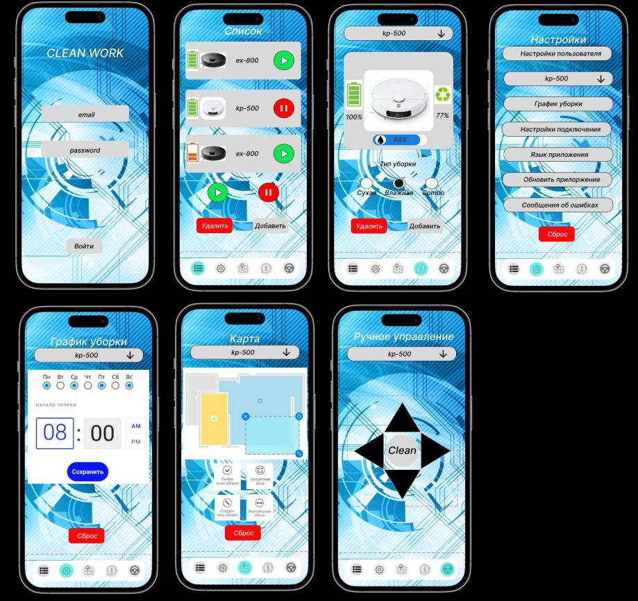

## Homework
Сквозной проект. Семинары 10-12
Семинар 10,11 и 12 представляют из себя сквозной проект.
Цель задания: научиться проектировать облачное приложение.
Задание: Спроектировать облачное приложение с интерфейсами в браузере и
нативными интерфейсами в мобильных устройствах.
● Необходимо спроектировать облачный сервис домашнего робота пылесоса для
уборки помещений.
● Результатом должны быть: компоненты интерфейсов, доменная модель, Use
case, компонентные диаграммы, EDR, API контракты, тестовые сценарии.
● Выполняется постепенно, в течении 3-х семинаров (блоков).

UseCase диаграмма для приложения управления роботом пылесосом

### UseCase_robot_vacuum_cleaner

Разработать UI/UX мобильного приложения управления роботом пылесосом Выполненную домашнюю работу выложить на свой GitHub в формате jpg
### UI_UX_FULL_robot_vacuum_cleaner

Инструменты:

https://www.figma.com/
https://app.diagrams.net/
https://www.dbdesigner.net/
https://swagger.io